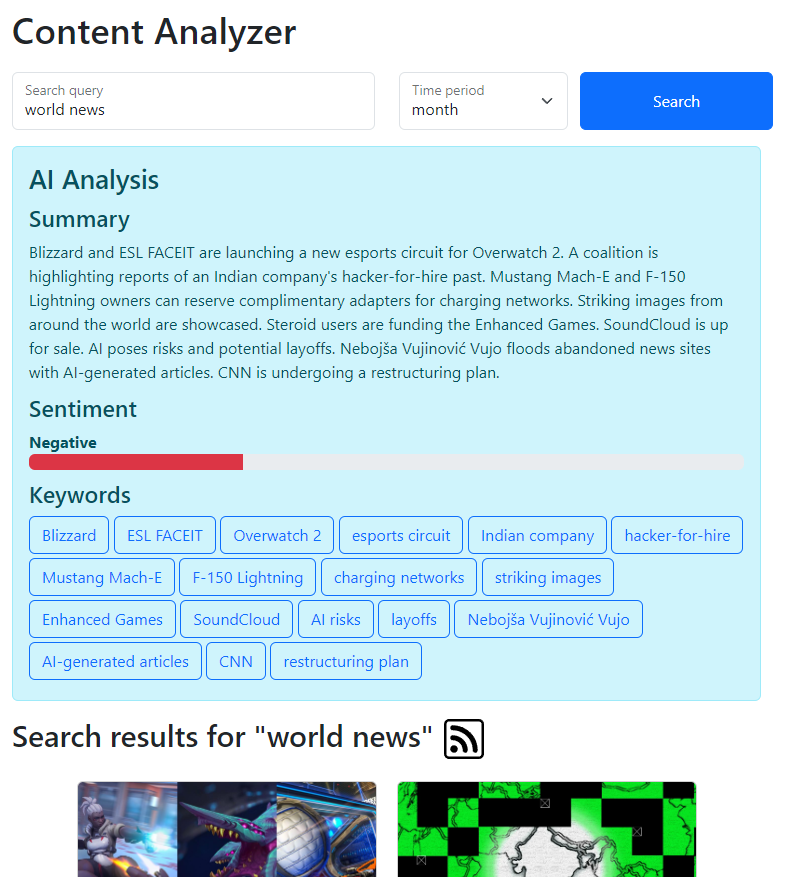
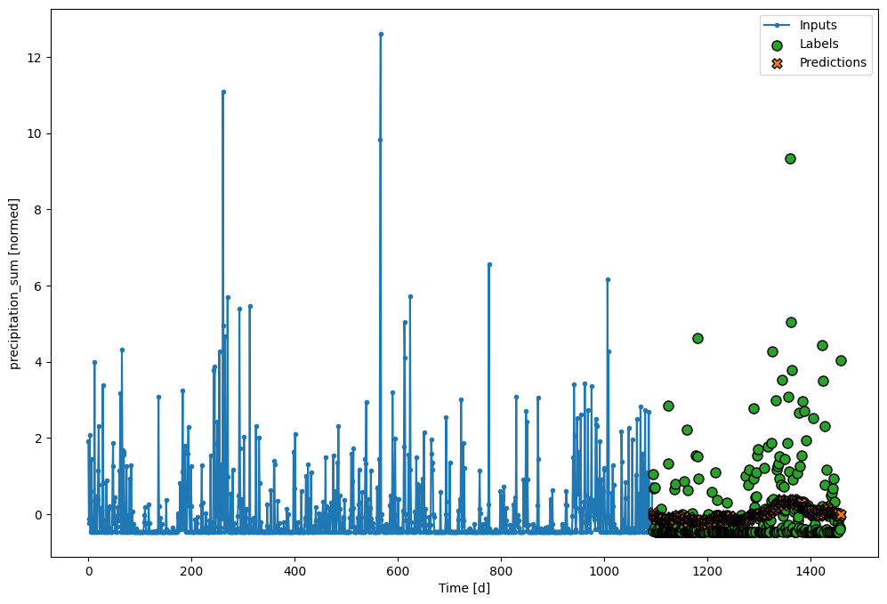

# Weather Forecast Application

## Overview
This project is a weather forecast web application for the IASA Champ '24 competition. It uses the [Open-Meteo API](https://github.com/open-meteo/open-meteo) to get the historical weather data for any city and an [LSTM model](https://www.tensorflow.org/api_docs/python/tf/keras/layers/LSTM) to forecast the weather for the next year.

Here is the quick video showing the project

https://github.com/PanVova/champ-iasa/assets/37262034/ae4b87fb-741c-470e-b3d0-fe2cca1d207e

## Features
- Real-time weather forecasts
- Search functionality for global locations
- Daily weather data display
- Caching for improved performance
- Robust error handling and input validation

## Technologies Used
- **Flask**: A lightweight WSGI web application framework in Python, used for building the web application.
- **Requests**: Used for making API calls to Open-Meteo.
- **Pandas**: For data manipulation and analysis.
- **NumPy**: Used in data processing and calculations.
- **TensorFlow**: For LSTM model predictions.
- **Joblib**: For loading the pre-trained scaler model.
- **HTML/CSS**: For frontend development.
- **unittest**: Python's built-in library used for writing and running tests.

## Installation
To set up the project locally, follow these steps:
### Docker installation
Execute the following command to run the project.
```bash
docker compose up
```
### Alternative installation
1. Create the virtual environment.
```bash
python -m venv .venv
```
2. Activate the virtual environment.
- For Windows, use:
```bash
.venv\Scripts\activate
```
- For macOS/Linux, use:
```bash
source .venv/bin/activate
```
3. Install the dependencies and run the project.
```bash
pip install -r requirements.txt
flask run
```

## Usage
To use the application, open your web browser and go to [http://localhost:5000](http://localhost:5000). You will see the following page.

Enter the name of the city you want to search for, and Open-Meteo will return a list of best matches.

Select a city from the dropdown and click on the "Get Forecast" button. You will see the weather forecast for the next year.


## Weather Parameters
The weather forecast includes the following parameters:
- Temperature
Maximum air temperature at 2 meters above ground (°) / Minimum air temperature at 2 meters above ground (°).
- Humidity
Relative humidity at 2 meters above ground (%).
- Wind
Maximum wind speed at 10 meters above ground (km/h) / Wind direction at 10 meters above ground (°).
- Pressure
Atmospheric air pressure reduced to mean sea level (hPa).

## Project Structure
The project is structured as follows:
- `app.py`: The main file that contains the Flask application.
- `models`: Model information.
  - `lstm.py`: LSTM model.
  - `scaler.save`: Scaler used to normalize the data.
- `static`: CSS and JavaScript files.
- `templates`: HTML files.
- `test_app.py`: Tests for the application.

## Testing
The project includes a test suite to ensure the reliability and performance of the application. To run the tests, execute `python -m unittest test_app.py`.

## Explanation
- Data aggregation
Data is aggregated from Open-Meteo using the `openmeteo_requests` library. This API was chosen due to its free access to all features, fast response times, 80 years of historical data, and no API key requirements. [Open-Meteo's archive](https://open-meteo.com/en/docs/historical-weather-api) gets the data with a 2-day delay, so the [forecast endpoint](https://open-meteo.com/en/docs) with parameter `past_days` is used to fetch the missing data.  
The forecasting model was trained on 40 years of historical weather data for several locations.
When predicting the weather, the last 3 years of data for the location are fetched and used as an input to an LSTM model.
- Data preprocessing
The data is preprocessed using the recommended best practices for [time series forecasting using TensorFlow](https://www.tensorflow.org/tutorials/structured_data/time_series). This includes normalizing the data, splitting it into training, validation, and testing sets, and creating a windowed dataset for the LSTM model. The `date` column from the API was converted to `year sin` and `year cos` to capture the cyclical nature of the data. The `wind speed` and `wind direction` were converted to `wind x` and `wind y` to match model training requirements.
- Forecasting algorithm
The forecasting algorithm uses an LSTM model to predict the weather for the next year. LSTM models are traditionally used for time series forecasting, surpassing other approaches like ARIMA and RNNs.
An alternative [Prophet](https://github.com/facebook/prophet) model was considered because of its ease of use and interpretability (namely, the decomposition into trend and seasonality). However, the LSTM model was ultimately chosen due to its multivariate forecasting ability, while Prophet only features univariate forecasting.
- Model accuracy
The model's accuracy is evaluated using the mean absolute error (MAE) metric. The MAE is calculated for each weather parameter and then averaged to get the final accuracy score.
Results:  
Separate models for predicting 1 day, 1 week, 1 month, and 1 year into the future were created, but all of them showed similar error values. It was decided to use the 1-year model for the final application.  
Its MAE (normalized): 0.5287  
Although this error is significant, some parameters (like temperature) have much lower error values, and can be predicted with high accuracy.
  - Temperature
Temperature forecasting has the smallest error, due to the clear seasonal patterns in the data.


  - Precipitation
This parameter is characterized by relatively low values and then sudden spikes; thus, the model averaged the predictions near the zero mark.

  - Humidity
Humidity has a certain seasonal pattern, though the error is still significant.

  - Cloud cover
While there is a noticable seasonal component to cloud cover, this parameter is mostly chaotic for the model, leading to significant errors.

  - Wind
Wind speed and direction are highly chaotic and do not exhibit trend or seasonality, so the model struggled with predicting this parameter.


  - Pressure
Pressure is mostly chaotic, with a slight seasonal pattern/

- UI
The UI was designed using Bootstrap to ensure a responsive and mobile-friendly design. Many Bootstrap components were used, such as alert, button, dropdown, table, and spinner.  
The UI features a search bar with autocomplete functionality, a dropdown to select the city, and a button to get the forecast. The forecast is displayed in a table with the weather parameters and a spinner is shown while the data is being fetched.