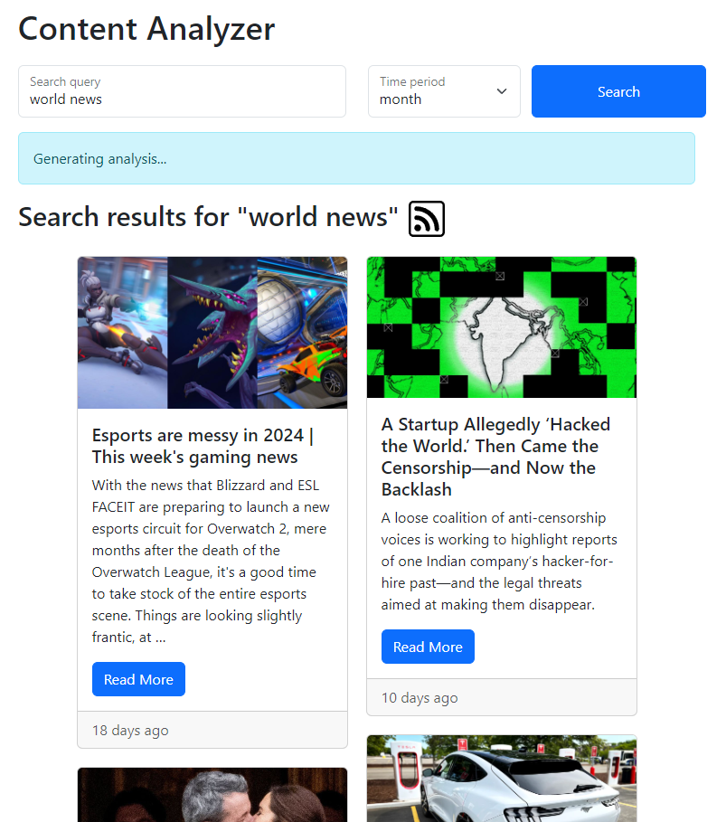

# Content Analysis Application

## Overview
This project is a content analysis application for the [IASA Champ '24](http://champ.iasa.kpi.ua/) competition. It uses the [NewsAPI](https://newsapi.org/) to fetch news articles by keyword and the [OpenAI API](https://platform.openai.com/docs/overview) to perform NLP on them.

Here's a quick video demo of the application:  
[Demo](docs/demo.mp4)

## Features
- Relevant news articles for the last day, month, and week
- Content summarization, sentiment analysis, and keyword extraction
- RSS feed for the latest news
- Intuitive UI for easy navigation
- Responsive design for mobile and desktop
- Robust error handling
- Dockerized for easy deployment

## Technologies
- **Flask** - Web framework
- **Bootstrap** - Frontend framework
- **NewsAPI** - News articles API
- **OpenAI API** - NLP API
- **Docker** - Containerization

## Installation
To set up the project locally, follow these steps:
### Docker installation
1. Replace the `NEWSAPI_KEY` and `OPENAI_API_KEY` in the [docker-compose.yml](docker-compose.yml) file with your own keys.
2. Execute the following command to run the project.
```bash
docker compose up
```
### Alternative installation
1. Create the virtual environment.
```bash
python -m venv .venv
```
2. Activate the virtual environment.
- For Windows, use:
```bash
.venv\Scripts\activate
```
- For macOS/Linux, use:
```bash
source .venv/bin/activate
```
3. Install the dependencies and run the project.
```bash
pip install -r requirements.txt
```
4. Rename the file [.env.example](.env.example) to `.env`, replace the `NEWSAPI_KEY` and `OPENAI_API_KEY` with your own keys.
5. Run the project.
```bash
flask run
```

## Usage
| Step | Action | Screenshot |
|------|--------|------------|
| 1    | Open your web browser and go to [http://localhost:5000](http://localhost:5000). |  |
| 2    | Enter the keyword and the time period for your search. NewsAPI will return a list of best matches. |  |
| 3    | After a couple of seconds, OpenAI will generate an analysis of best matches, returning the summary, sentiment, and keywords. |  |
| 4    | Click on the RSS icon to get the RSS feed of the results. |  |

## Project Structure
The project is structured as follows:
- `app.py`: The main file that contains the Flask application.
- `static`: CSS and JavaScript files.
- `templates`: HTML files.
- `test_app.py`: Tests for the application.

## Testing
The project includes a test suite to ensure the reliability and performance of the application. To run the tests, execute `python -m unittest`.

## Explanation
### Data aggregation
Data is aggregated using the NewsAPI, returning the most relevant 10 articles for the last day, month, and week.
### NLP
The OpenAI API function calling is used to perform NLP on the articles, generating a summary, sentiment, and keywords.